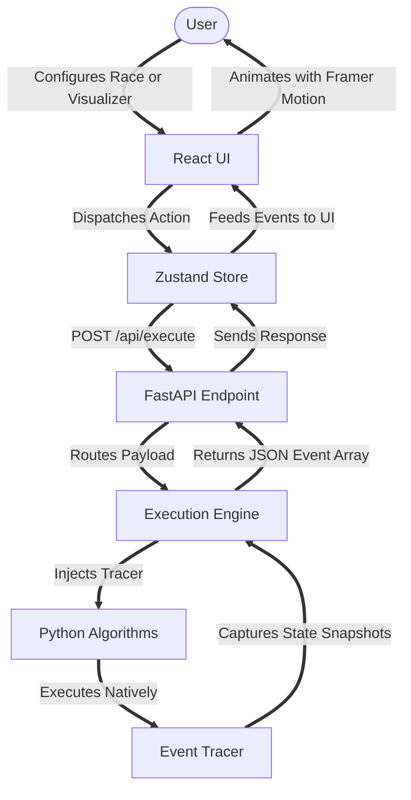

<div align="center">
  <h1>Algorithm Laboratory 🧪</h1>
  <p>An interactive web platform for visualizing data structures and benchmarking algorithms side by side.</p>

  <p><strong>🌐 Live Demo: <a href="https://algorithm-laboratory.vercel.app">algorithm-laboratory.vercel.app</a></strong></p>

  
  
  
  
  
  
  
</div>

<br />

Welcome to the **Algorithm Laboratory**! Have you ever wondered what exactly happens inside a Quick Sort, or why Binary Search is so much faster than Linear Search? I built this project to answer those questions visually. 

Algorithm Laboratory takes complex computer science concepts and turns them into interactive, fluid animations. It is not just a visualizer; it is a full workbench where you can build datasets, race algorithms, and study their internal mechanics line by line.

### ✨ What You Can Do

#### 1. Interactive Visualizer
The core of the laboratory. Select an algorithm, generate a random dataset (Array or Graph), and watch the magic happen. You are in complete control of the playback: play, pause, step forward, rewind, or adjust the speed dynamically. As the algorithm runs, a code viewer highlights the exact line of code currently being executed.

#### 2. Algorithmic Racing (Benchmark)
The most exciting feature of the app. Put two algorithms head to head on identical datasets! The Benchmark page features a split screen where you can, for example, pit Bubble Sort against Merge Sort. It tracks execution time, total steps, comparisons, and memory space. A smart synchronization system ensures you only compare algorithms that solve the same problem.

#### 3. Sandbox Playground
Want to test a specific edge case? The Playground allows you to build custom arrays manually. You can tweak individual values, enforce sorting (required for Binary Search), and see how algorithms behave on your tailored data.

<br />

### 🧠 How It Works (The Snapshot Methodology)

You might be wondering: how do we pause a Python algorithm from a React frontend? 

Traditional visualizers often simulate algorithms in JavaScript using generator functions. However, Algorithm Laboratory takes a different, more authentic approach. We run the actual native Python code on the backend and trace its execution.

Because HTTP requests are stateless and time out, we cannot keep a connection open and constantly pause the Python server. Instead, we use a **Snapshot Tracing Methodology**:

1. **The Request:** The frontend sends the chosen algorithm and dataset to the backend.
2. **The Execution:** The Python engine runs the algorithm instantly from start to finish.
3. **The Tracer:** As the algorithm runs, a custom tracing engine hooks into the logic. Every time a variable changes, two items are swapped, or a graph node is visited, the tracer takes a snapshot of the current state.
4. **The Response:** The backend packages all these snapshots into a chronological array of events and sends it back.
5. **The Playback:** The frontend receives this array. The Zustand state manager acts like a VCR player, allowing you to scrub through the events. Framer Motion calculates the difference between snapshots and smoothly animates the elements to their new positions.

<br />

### 🏗️ System Architecture Workflow



<br />

### 📂 Project Structure

Algorithm Laboratory uses a decoupled frontend and backend architecture.

**Frontend Workspace (React / Vite / Tailwind)**
* `src/components/` Contains all the reusable UI elements like dropdowns, sliders, and playback controls.
* `src/pages/` The main views (Visualizer, Benchmark, Playground).
* `src/visualizers/` The complex rendering components where Framer Motion animates the arrays and graphs.
* `src/store/` The Zustand global state that acts as the bridge between the UI and the backend data.

**Backend Workspace (Python / FastAPI)**
* `app/api/` Contains the FastAPI routers that handle incoming requests.
* `app/engine/` The core execution logic and event tracer that captures the snapshots.
* `app/algorithms/` The raw, native Python implementations of sorting and searching algorithms.
* `app/models/` Pydantic schemas that ensure data validation between the frontend and backend.

<br />

### 🚀 Quick Start Guide

Want to run this locally? It is incredibly easy.

#### Prerequisites
* Node.js (v18 or higher)
* Python (v3.10 or higher)

#### 1. Clone the repository
```bash
git clone https://github.com/Arunan-Kavirajan/algorithm-laboratory.git
cd algorithm-laboratory
```

#### 2. Start the Python Backend
Navigate to the root directory and install the Python dependencies. Then, start the FastAPI server:
```bash
pip install -r requirements.txt
uvicorn api.index:app 
```
*Note: The API will be available at `http://localhost:8000`*

#### 3. Start the React Frontend
Open a fresh terminal window, navigate to the `frontend` folder, install the node modules, and spin up the development server:
```bash
cd frontend
npm install
npm run dev
```
*Note: The frontend will be available at `http://localhost:5173`*

<br />

### 🤝 Contributing & License

This project is open sourced under the MIT License. Contributions, issues, and feature requests are highly welcome! Whether you want to add a new algorithm like pathfinding, or improve the UI, feel free to fork the repository and submit a pull request.
